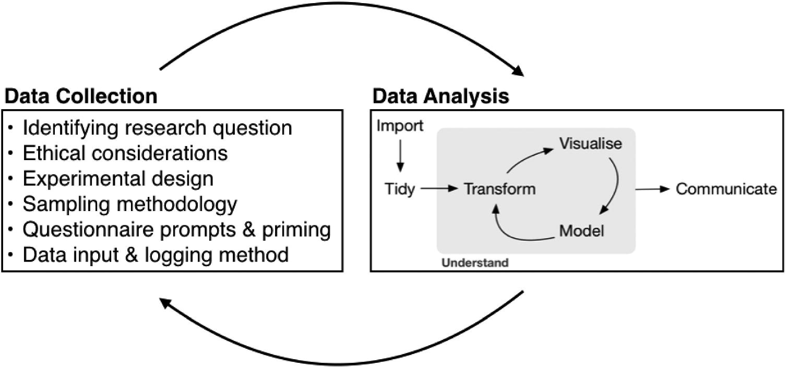
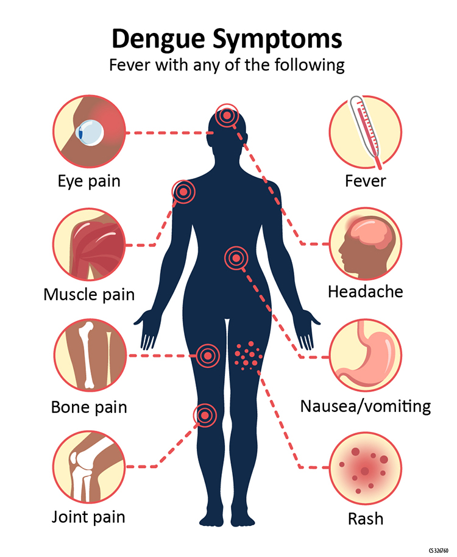

## Welcome to STA 712!

Agenda:

<br/>

* Brief course overview and syllabus highlights

<br/>

* Sketch plan for first couple weeks

<br/>

* Logistic regression

\vspace{3cm}

## Learning goals

* **Choosing reasonable methods:** select and fit an appropriate model, and use that model to answer questions of interest

\smallskip

* **Statistical thinking:** curious about the data, skeptical about the limitations of our methods, and cautious about our conclusions

\smallskip

* **"What can I do differently?":** we need to adapt to the data and the situation, not the other way around!

\smallskip

* **Theory and simulation** to characterize properties and assumptions of statistical models, and explore consequences of different modeling choices

\smallskip

* **Communicating** results in context

## The role of modeling

*Essentially, all models are wrong, but some are useful.* (Box and Draper, 1987)


\vspace{0.5cm}

\begin{small}
(Image from \textit{Veridical Data Science}, Yu and Barter)
\end{small}

## Components of (good) data analysis



\vspace{1cm}

\begin{tiny}
Albert Y. Kim \& Johanna Hardin (2021) "Playing the Whole Game": A Data Collection and Analysis Exercise With Google Calendar, Journal of Statistics and Data Science Education, 29:sup1, S51-S60, DOI: 10.1080/10691898.2020.1799728
\end{tiny}

## Overview of course content

* Core types of models: GLMs (and variants)
    * Logistic regression (binary responses), Poisson regression (count responses), linear regression (some continuous responses)
    * GLM theory
* Model extensions/generalizations
    * Overdispersion in count data: quasi-Poisson and negative binomial models
    * Excess 0s: zero-inflated models
    * Dependent data: mixed models (time permitting)
* Model assessment
    * Diagnostics for model assumptions
    * Assessing model predictions
* Inference (hypothesis tests and confidence intervals)
    * Wald and LRT
    * Parametric bootstrap (time permitting)

## Course structure

* Class participation and seminar attendance

<br/>

* Assigned readings

<br/>

* Regular HW assignments (due most weeks)

<br/>

* Homework presentations (3)

<br/>

* One midterm exam

<br/>

* Project (throughout second half of semester)

<br/>

* Final exam

\vspace{3cm}


## Plan for the first couple weeks

Recap logistic regression

* Motivation and interpretation
* Estimation
* Inference

\bigskip    
    
Model assessment

* Assumptions and diagnostic plots
* Outliers and multicollinearity
* Assessing predictions
    
\vspace{3cm}

## Motivating example: Dengue fever

**Dengue fever:** a mosquito-borne viral disease affecting 400 million people a year




## Motivating example: Dengue data

**Data:** Data on 5720 Vietnamese children, admitted to the hospital with possible dengue fever. Variables include:

* *Sex*: patient's sex (female or male)
* *Age*: patient's age (in years)
* *WBC*: white blood cell count
* *PLT*: platelet count
* other diagnostic variables...
* *Dengue*: whether the patient has dengue (0 = no, 1 = yes)

**Research goal:** Predict dengue status using diagnostic measurements

**Question:** What type of model should we use, and why?

## Logistic regression model

The original authors chose the following model:

$$Dengue_i | Age_i, WBC_i, PLT_i \ \sim \ Bernoulli(p_i)$$

$$\log \left(\dfrac{p_i}{1 - p_i}\right) = \beta_0 + \beta_1 Age_i + \beta_2 WBC_i + \beta_3 PLT_i$$

**Question:** Why is there no noise term $\varepsilon_i$ in the logistic regression model?

## Logistic regression model

```{r, include=F}
library(glmhelpR)
```

```{r}
m1 <- glm(Dengue ~ Age + WBC + PLT, 
          data = dengue, family = binomial)
summary(m1)$coefficients
```

**Question:** How would I interpret the estimated coefficient $\widehat{\beta}_1 = 0.1383$ for Age? 

\vspace{3cm} 

## Another example

Examining a health survey in the Netherlands, researchers saw a potential association between having a pet bird and developing lung cancer. They now want to conduct a follow-up study to further examine whether individuals who keep pet birds are at greater risk.

\bigskip

**Questions:**

* How would you try to design this study? 
* What data would you want to collect?
* What model would you want to use?

\vspace{2cm}

## Class activity

```{r, include=F, message=F, warning=F}
library(tidyverse)

birdkp = read.table(
  "http://www.stat.uchicago.edu/~yibi/s226/birdkeeping.txt",
  header=TRUE)
birdkp <- birdkp |>
  mutate(LC = ifelse(LC == "NoCancer", 0, 1),
         BK = ifelse(BK == "NoBird", 0, 1)) |>
  rename(Cancer = LC,
         Sex = FM,
         SocEc = SS,
         Age = AG,
         SmokeYrs = YR,
         SmokeRate = CD,
         Bird = BK)
```

```{r, echo=F}
m_bird <- glm(Cancer ~ Bird + Sex + SocEc + Age + 
                SmokeYrs + SmokeRate, 
              data = birdkp, family = binomial)

coef(m_bird)
```

Interpret the estimated coefficient 1.363 in context.

\vspace{5cm}

## Class activity

```{r, echo=F}
coef(m_bird)
```

The estimated coefficient on Age is negative. Why might that be the case? Is there anything you would change in the model?

\vspace{5cm}

## Class activity

```{r, echo=F}
coef(m_bird)
```

What is the predicted probability of lung cancer for a male individual who keeps a bird, of "high" socioeconomic status, aged 35, who has never smoked?

\vspace{5cm}

## Class activity

```{r, echo=F}
coef(m_bird)
```

$$\frac{\exp\{-1.271 + 1.363 - 0.561 - 0.040(35)\}}{1 + \exp\{-1.271 + 1.363 - 0.561 - 0.040(35)\}} = 0.134$$

\vspace{4cm}


