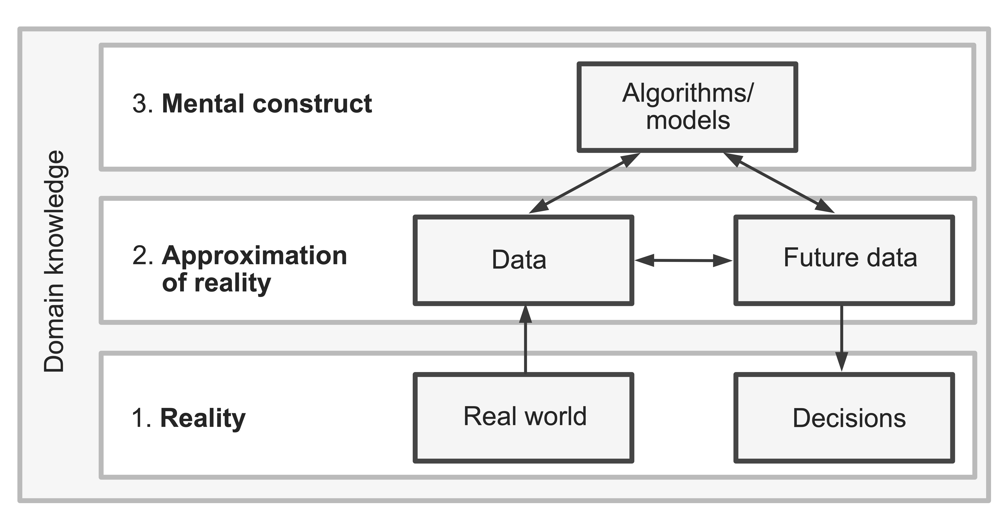

## Model assessment

*Essentially, all models are wrong, but some are useful.* (Box and Draper, 1987)



**Question:** Is our model useful?

\vspace{0.1cm}

\begin{tiny}
(Image from \textit{Veridical Data Science}, Yu and Barter)
\end{tiny}

## Model assessment

We observe data $(\mathbf{x}_1, Y_1),...,(\mathbf{x}_n, Y_n)$ and fit the model

$$
\begin{aligned}
Y_i | \mathbf{x}_i &\sim Bernoulli(p_i) \\
\log \left( \dfrac{p_i}{1 - p_i} \right) &= \mathbf{x}_i^T \boldsymbol{\beta}
\end{aligned}
$$

How do we assess whether the model is useful?

\vspace{4cm}

## Model assumptions

$$
\begin{aligned}
Y_i | \mathbf{x}_i &\sim Bernoulli(p_i) \\
\log \left( \dfrac{p_i}{1 - p_i} \right) &= \mathbf{x}_i^T \boldsymbol{\beta}
\end{aligned}
$$

What assumptions do we make when fitting this logistic regression model?

\vspace{4cm}

## Shape assumption

$$
\begin{aligned}
Y_i | \mathbf{x}_i &\sim Bernoulli(p_i) \\
\log \left( \dfrac{p_i}{1 - p_i} \right) &= \mathbf{x}_i^T \boldsymbol{\beta}
\end{aligned}
$$

**Shape assumption:** The log-odds are a linear function of the explanatory variables (i.e., the systematic component is correctly specified).

**Question:** How do we assess the shape assumption in a *linear* regression setting?

\vspace{4cm}


## Residual plot?

Raw residuals: $Y_i - \widehat{p}_i$

**Question:** what will the plot look like if we plot $Y - \widehat{p}$ vs. $X$?

\vspace{5cm}

## Residual plot?

Raw residuals: $Y_i - \widehat{p}_i$

**Question:** what will the plot look like if we plot $Y - \widehat{p}$ vs. $X$?

Example: predicting dengue status with Age

```{r, message=F, warning=F, echo=F, fig.width=5, fig.height=3}
library(tidyverse)
library(glmhelpR)

m1 <- glm(Dengue ~ Age, data = dengue, family = binomial)
data.frame(Age = dengue$Age, resids = dengue$Dengue - m1$fitted.values) |>
  ggplot(aes(x = Age, y = resids)) +
  geom_point() +
  geom_abline(slope = 0, intercept = 0) +
  theme_bw() +
  labs(x = "Age", y = "Raw residuals")
```

## Alternative: empirical logits

For each Age, calculate the *empirical* log odds of dengue (aka *empirical logits*):

```{r, echo = F}
dengue |>
  group_by(Age) |>
  summarize(NoDengue = sum(Dengue == 0),
            YesDengue = sum(Dengue == 1),
            p = mean(Dengue),
            log_odds = log(p/(1 - p)))
```

## Empirical logit plot

```{r, message=F, warning=F, echo=F, fig.width=5, fig.height=4}
dengue |>
  group_by(Age) |>
  summarize(NoDengue = sum(Dengue == 0),
            YesDengue = sum(Dengue == 1),
            p = mean(Dengue),
            log_odds = log(p/(1 - p))) |>
  ggplot(aes(x = Age, y = log_odds)) +
  geom_smooth(method = "lm", se=F) +
  geom_point() +
  theme_bw() +
  labs(x = "Age", y = "Empirical log odds")
```

## Empirical logits with a continuous variable

Trying with WBC:

```{r, echo = F}
dengue |>
  group_by(WBC) |>
  summarize(NoDengue = sum(Dengue == 0),
            YesDengue = sum(Dengue == 1),
            p = mean(Dengue),
            log_odds = log(p/(1 - p))) |>
  head()
```

What has gone wrong? What should we do differently?

## Binned empirical logit plots

```{r, echo=F, message=F, warning=F, fig.width=4, fig.height=3}
emp_logit_plot(dengue, Dengue ~ WBC, num_bins = 15)
```

Does the shape assumption seem reasonable?

## Binned empirical logit plots

```{r, echo=F, message=F, warning=F, fig.width=4, fig.height=3}
emp_logit_plot(dengue, Dengue ~ log(WBC), num_bins = 15)
```

## Binned empirical logit plots

```{r, echo=F, message=F, warning=F, fig.width=4, fig.height=3}
emp_logit_plot(dengue, Dengue ~ log(WBC), group = Vomiting, num_bins = 15)
```

## Limitations of empirical logit plots

* Does not assess a fitted model (performed *before* fitting the model)

\smallskip

* One point per *bin*, not one point per *observation*

\smallskip

* Can only plot one or two explanatory variables at a time

\vspace{3cm}

## Randomized quantile residuals

Define *randomized quantile residuals* $r_{Q,i}$:

\vspace{6cm}

## Randomized quantile residuals

**Simulated data:** $\log \left( \frac{p_i}{1 - p_i} \right) = -1 + 2X_i$

\smallskip

**Model fit:** $\log \left( \frac{p_i}{1 - p_i} \right) = \beta_0 + \beta_1 X_i$

\smallskip

```{r fig.width=3.5, fig.height=2.5, echo=F, message=F}
set.seed(5349234)

# generate data
n <- 1000
x <- runif(n, -5, 5)
p <- exp(-1 + 2*x)/(1 + exp(-1 + 2*x))
y <- rbinom(n, 1, p)

# fit the model (correctly specified)
m_sim <- glm(y ~ x, family = binomial)

# make a quantile residual plot
data.frame(x = x, residuals = statmod::qresid(m_sim)) |>
  ggplot(aes(x = x, y = residuals)) +
  geom_point(size=0.5) +
  geom_smooth() +
  theme_bw() +
  labs(y = "Randomized quantile residuals",
       title = "Correctly specified model")
```


## Randomized quantile residuals

**Simulated data:** $\log \left( \frac{p_i}{1 - p_i} \right) = -1 + 2X_i^2$

\smallskip

**Model fit:** $\log \left( \frac{p_i}{1 - p_i} \right) = \beta_0 + \beta_1 X_i$

\smallskip

**Question:** What do you think the randomized quantile residual plot will look like?

\vspace{4cm}

## Randomized quantile residuals

**Simulated data:** $\log \left( \frac{p_i}{1 - p_i} \right) = -1 + 2X_i^2$

\smallskip

**Model fit:** $\log \left( \frac{p_i}{1 - p_i} \right) = \beta_0 + \beta_1 X_i$

\smallskip

```{r fig.width=3.5, fig.height=2.5, echo=F, message=F}
# generate data
n <- 1000
x <- runif(n, -5, 5)
p <- exp(-1 + 2*x^2)/(1 + exp(-1 + 2*x^2))
y <- rbinom(n, 1, p)

# fit the model (correctly specified)
m_sim <- glm(y ~ x, family = binomial)

# make a quantile residual plot
data.frame(x = x, residuals = statmod::qresid(m_sim)) |>
  ggplot(aes(x = x, y = residuals)) +
  geom_point(size=0.5) +
  geom_smooth() +
  theme_bw() +
  labs(y = "Randomized quantile residuals",
       title = "Mis-specified model")
```

## Example: dengue data

**Model:**  $\log \left( \frac{p_i}{1 - p_i} \right) = \beta_0 + \beta_1 \text{WBC}_i$

```{r fig.width=3.5, fig.height=2.5, echo=F, message=F}
m_d <- glm(Dengue ~ WBC, data = dengue, family = binomial)

set.seed(3)
data.frame(x = dengue$WBC, residuals = statmod::qresid(m_d)) |>
  ggplot(aes(x = x, y = residuals)) +
  geom_point(size=0.5, alpha=0.5) +
  geom_smooth() +
  theme_bw() +
  labs(y = "Randomized quantile residuals", x = "WBC")
```

\vspace{2cm}

## Example: dengue data

**Model:**  $\log \left( \frac{p_i}{1 - p_i} \right) = \beta_0 + \beta_1 \text{WBC}_i$

```{r fig.width=3.5, fig.height=2.5, echo=F, message=F}
m_d <- glm(Dengue ~ WBC, data = dengue, family = binomial)

set.seed(3)
data.frame(x = dengue$WBC, residuals = statmod::qresid(m_d)) |>
  ggplot(aes(x = x, y = residuals)) +
  geom_point(size=0.5, alpha=0.5) +
  geom_smooth() +
  theme_bw() +
  labs(y = "Randomized quantile residuals", x = "WBC")
```

**Question:** How can we decide whether a plot is consistent with a correctly-specified model?

## Parametric bootstrap

The *parametric bootstrap* generates data from the *fitted* model:

\vspace{6cm}


## Visual inference

```{r, fig.width=8, fig.height=6, echo=F}
library(regressinator)

set.seed(3)

qresid_wbc <- function(f){
  data.frame(resid = statmod::qresid(f),
             x = model.frame(f)$WBC)
}

p1 <- model_lineup(m_d, fn = qresid_wbc, nsim = 20) |> 
  ggplot(aes(x = x, y = resid)) +
  geom_point(size = 0.25) +
  geom_smooth(method = 'gam', formula = y ~ s(x, bs = "cs")) +
  facet_wrap(vars(.sample)) +
  labs(x = "WBC", y = "Residual") +
  theme_bw()

p1
```

## Visual inference

```{r, fig.width=6, fig.height=4, echo=F}
p1
```

```{r}
decrypt("QUg2 qFyF Rx 8tLRyRtx Ko")
```


